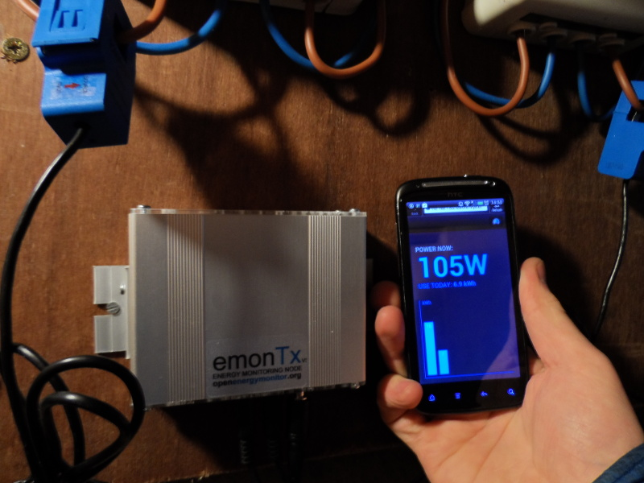
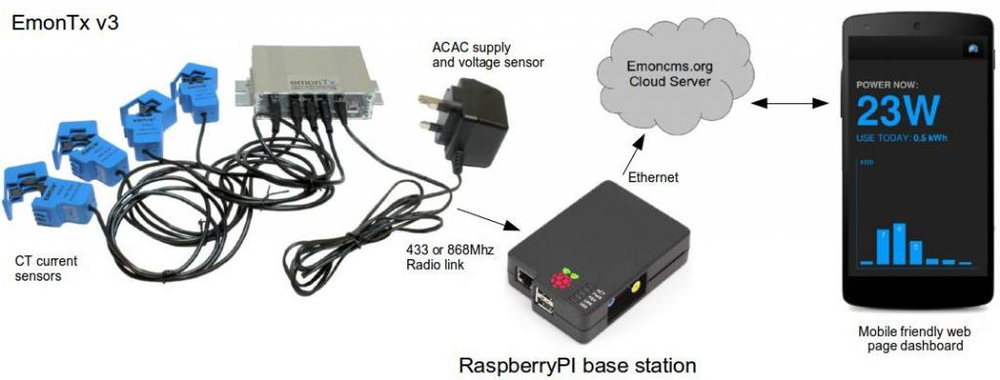
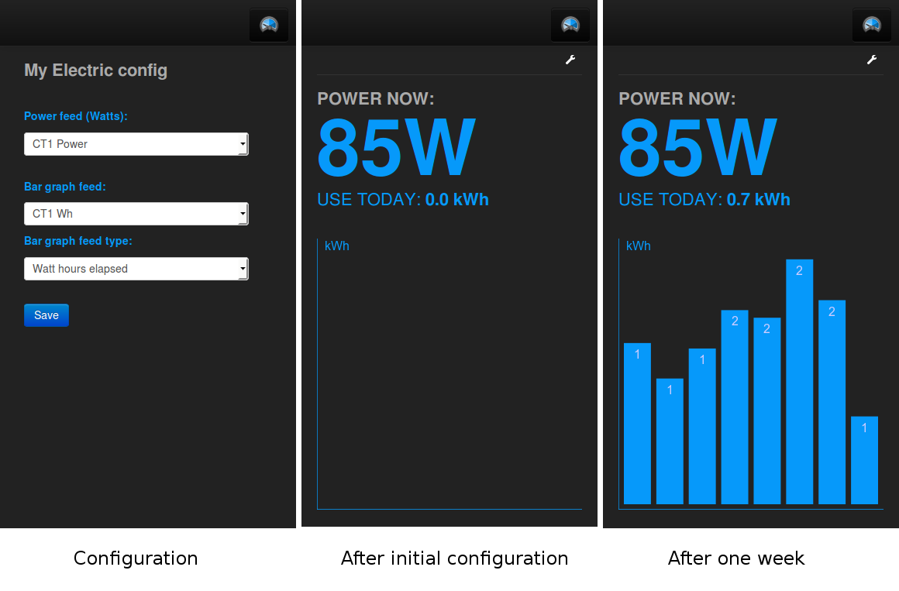

# Home Energy Monitor

**(emonTx v3, Raspberry Pi, Emoncms V8)**

This guide details how to build a web-connected home electricity monitor using the OpenEnergyMonitor emonTx V3, a Raspberry Pi (with RFM12Pi expansion board) and Emoncms web-app for logging and viewing the data. At the end of this guide you should have your system up and running with your energy data accessible on a mobile friendly web page like this:

## System overview

## Parts list

Here are the parts you will need, most of them are available from the OpenEnergyMonitor shop.

    1x emonTx V3 pre-assembled
    1x 100A max clip-on current sensor CT
    1x AC-AC Power Supply Adapter - AC voltage sensor (Both UK and Euro plugs are available)

    1x Raspberry Pi (Model B) - Web-connected Base Station
    1x RFM12Pi - Raspberry Pi Base Station Receiver Board
    1x Blank SD Card
    1x (optional) RaspberryPi case, this one is nice: Pimoroni Berryblack Case

Note: it's important that the frequency (868Mhz / 433Mhz) of the chosen modules match each other and is a legal ISM band in your country.

You might also need:

    1x 5V DC USB Power Adapter (UK Plug)
    1x Micro-USB cable
    1x Ethernet cable
    1x USB to serial programmer

## System setup

The OpenEnergyMonitor hardware listed above all come pre-assembled, no soldering is required. However for this particular configuration we need to change the default firmware on the emonTx in order to gain the benefit of the new addition of accumulated watt-hours calculation on the emonx which increases the accuracy and reliability of the energy measurement.

Changing the EmonTx firmware

1. Start by following the: setting up the arduino anvironment guide

2. Click on File > sketchbook > OpenEnergyMonitor > emonTxFirmware > emonTxV3 > 
RFM12B > Examples > emonTxV3_continuous_kwhtotals_noeeprom. This will load the 
firmware example that both uses the higher accuracy continuous sampling code by 
Robin Emley and the watt hour calculation code mentioned above.

3. Set the frequency of your emontx at the top of the sketch/firmware and nodeid 
if you wish to change it. Plug up your emonTx v3 with a usb to serial programmer 
and click on Upload.

**Continuing with the hardware installation:**

Place or mount your emontx near your meter cabinet, the emonTx V3 comes with wall mounts as can be seen in the example installation above.

Plug in the CT sensor into the emonTx first before clipping it around the mains wire and before powering-up the emonTx. Clip the sensor around either the live or neutral wire of the circuit you wish to measure. (Don't clip around both as the magnetic fields will cancel).

Plug in the AC-AC Voltage adapter this both power's the emonTx and is used for sampling the AC mains voltage. A red light should now appear near the AC-AC adapter input and start flashing once every 10 seconds. Thats the emonTx set up! The emonTx can also be powered by batteries or from DC power source. See the emonTx technical wiki for info on using alternate power sources and interoperating the red LED behaviour

Plug the RFM12Pi hardware expansion module onto the Pi's GPIO pins taking care to align up pin 1, the RFM12Pi should be connected to the GPIO pins connector closest to the edge of the pi.

## Setting up the RaspberryPI

The raspberrypi can be configured in many different ways, you can record data locally onto a connected harddrive or you can forward data to a remove server such as emoncms.org.

**How to: setup a raspberrypi with a harddrive for local logging and visualisation (recommended).**
_Uses emonhub to link rfm12pi to local emoncms as well as having the ability to forward the data to multiple remote services_

**How to: setup a raspberrypi for posting data to multiple services including emoncms.org (recommended gateway)**
_Uses emonhub to read from rfm12pi and post data to multiple remote services. Weather a home server or/and emoncms.org or other_

**[How to: setup a raspberrypi gateway for sending data to emoncms.org (node only mode)](../../Modules/RaspberryPI/Gateway/gateway.md)**
_Uses emonhub to forward data directly to emoncms.org without decoding on the raspberrypi_

Ready to go image:
[http://217.9.195.228/2014-05-19-emonhub-gateway.img.zip](http://217.9.195.228/2014-05-19-emonhub-gateway.img.zip)

## Setting up emoncms

Navigate to the Node tab.

Click on the name of the node that appeared, it should show a drop down menu. Select the node type: EmonTx V3 (Continuous sampling with Wh totals). This will turn the undefined node into a full populated node with a list of available variables.

Click on Config for:

Power CT1: Select Log to feed, enter a name for the feed such as "Power CT1" or House Power or whatever, select the PHPFiwa feed engine and select the 10s feed interval (this is the same rate at which the EmonTx is posting)

Wh CT1: Again select Log to feed, enter a name for the feed such as "Wh CT1" or House Wh, select the PHPFina feed engine and select the 10s feed interval.

If your using the other CT's repeat for each CT.

Click on My Electric.

Click on the middle of the my electric page to bring up the configuration interface.

Select under the power feed: Power CT1

and under the Wh feed Wh CT1.

click save

Thats it you should now see your home electricity dashboard.

Open the page on your mobile phone and bookmark it. When you click on the bookmark it will automatically log you in and bring up your electricity dashboard.

## Using the monitor

The appliance list tool is a useful exercise for answering questions such as how much electricity can be save by using low energy lighting such as LED's? How much electricity does turning off lighting when not in use save?
Login to emoncms.org and then navigate to Extras > Report > Appliance list
The Electricity audit and savings case study provides more background on the appliance list exercise
