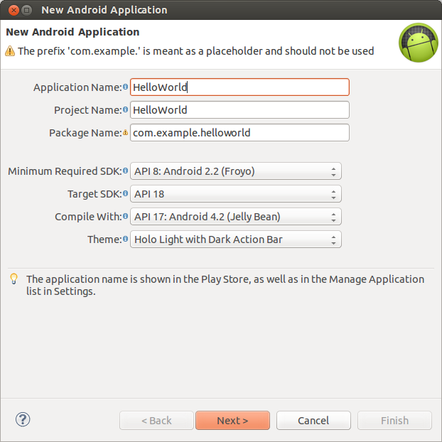
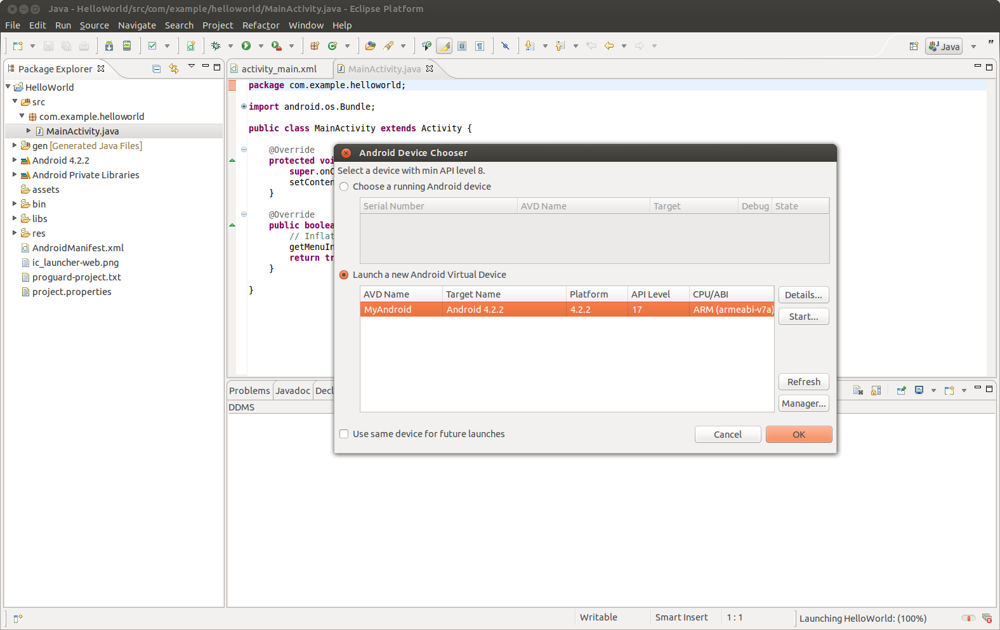
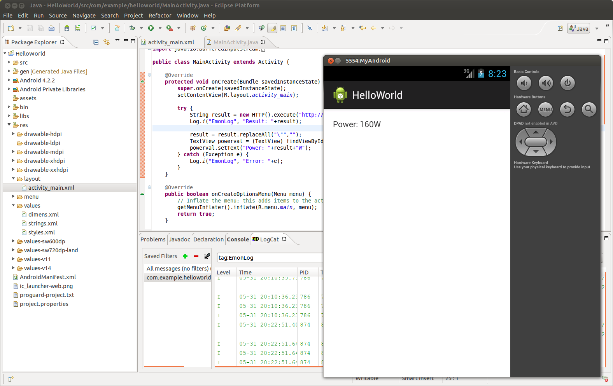

## Emon Android App project log + ongoing build guide

1) Start by installing Eclipse with Android SDK

[https://developer.android.com/sdk/installing/installing-adt.html](https://developer.android.com/sdk/installing/installing-adt.html)

2) Click New > Android Application Project. Give it a name such as HelloWorld. Select Android 4.2 for minimum required SDK. Click Next > Next > Next > Next > Finish.

3) Click Run, in adroid device chooser select 'Launch a new Android Virtual Device' then 'Manager' > 'New'. Give your virtual android a name and select a screen that's similar to your phone. Select your newly created virtual device and click Start to launch. Go back to the Android Device Chooser and select the newly appeared emulator.

4) Click Start, in a few moments your HelloWorld app will appear.

**Uploading the app to your phone**

1. Turn on developer mode: Click on Settings > About Phone, click 7 times on build number at the bottom to unlock developer mode.
2. Enable USB Debugging in your phone's developer mode settings
3. Connect your phone to your computer with a USB cable 
4. The phone should now appear in the targets list when you click on run in eclipse.

### 1) Fetching a feed value

As a first step it would be nice to get the current value of an emoncms feed and display it next to our hello world message

Searching for Android http request it seems the recommended way of making http requests is HttpURLConnection. The documentation for it gives a short example for retrieving a webpage: http://developer.android.com/reference/java/net/HttpURLConnection.html

    URL url = new URL("http://www.android.com/");
    HttpURLConnection urlConnection = (HttpURLConnection) url.openConnection();
    try {
	    InputStream in = new BufferedInputStream(urlConnection.getInputStream());
    } finally {
	    urlConnection.disconnect();
    }
    
Before we go any further we need to add android.permission.INTERNET to the projects AndroidManifest.XML file to give the app permisions to use the internet. Add the following line to AndroidManifest.XML just before the <application section

    <uses-permission android:name="android.permission.INTERNET"/>
			
If you try and run the first HttpURLConnection example in the onCreate method of the android app: The first thing you will notice is that there's a red cross in the left-hand margin and much of the code is underlined in red. Clicking on the red cross gives the option to Import 'URL' choose this, this will automatically add the URL dependency to the project (at the top). Once you've added all the dependencies it will then ask you surround the code in a try/catch: 

	try {
		URL url = new URL("http://www.android.com/");
		HttpURLConnection urlConnection = (HttpURLConnection) url.openConnection();
		try {
			InputStream in = new BufferedInputStream(urlConnection.getInputStream());
		} finally {
			urlConnection.disconnect();
		}
	} catch (Exception e) {
		Log.i("EmonLog", "Error: "+e);
	}

It will then upload to the virtual device ok but fail with the error NetworkOnMainThreadExeption. Reading up on this error tells us that Android does not allow Network IO to happen in the Main Thread, we need to run it in its own Thread and a common way to do this is with AsyncTask.

A basic AsyncTask class defenition looks like this:

    class MyAsyncTask extends AsyncTask<String, Void, String>
    {
	    @Override
	    protected String doInBackground(String... params) {
		    // TODO Auto-generated method stub
		    return null;
	    }	
    }
    
The AsyncTask can be called with:

    new MyAsyncTask().execute()
    
or if you want to pass back a result:

    String result = new MyAsyncTask().execute().get();
    
I have combined here the HTTP request code and the AsyncTask class and also added a few lines to read in the result of the request. Place this class below the MainActivity class:

    class HTTP extends AsyncTask<String, Void, String>
    {
	    @Override
	    protected String doInBackground(String... params) {
		    String result = "";
		    try {
			    String urlstring = params[0];
			    Log.i("EmonLog", "HTTP Connecting: "+urlstring);
			    URL url = new URL(urlstring);
			    HttpURLConnection urlConnection = (HttpURLConnection) url.openConnection();
			
			    try {
			        InputStream reader = new BufferedInputStream(urlConnection.getInputStream());
			        
			        String text = "";
			        int i = 0;
			        while((i=reader.read())!=-1)
			        {
			            text += (char)i;
			        }
			        Log.i("EmonLog", "HTTP Response: "+text);
			        result = text;
			        
			    } catch (Exception e) {
				    Log.i("EmonLog", "HTTP Exception: "+e);
			    }
			    finally {
				    Log.i("EmonLog", "HTTP Disconnecting");
		            urlConnection.disconnect();
			    }
			
		    } catch (Exception e) {
			    e.printStackTrace();
			    Log.i("EmonLog", "HTTP Exception: "+e);
		    }
		
		    return result;
	    }
    }

Then in the MainActivity class execute the HTTP AsyncTask class like this:

    public class MainActivity extends Activity {

	    @Override
	    protected void onCreate(Bundle savedInstanceState) {
		    super.onCreate(savedInstanceState);
		    setContentView(R.layout.activity_main);
		
		    try {
			    String result = new HTTP().execute("http://emoncms.org/feed/value.json?apikey=7f1b46367a013db07d2d65e588d2ad93&id=43348").get();
			    Log.i("EmonLog", "Result: "+result);
		    } catch (Exception e) {
			    Log.i("EmonLog", "Error: "+e);
		    }
	    }
	    
**Run and look at the result of LogCat**
If you now run this on your virtual android device and look at the result in the eclipse LogCat (below the source code editor) you should see that it makes a successful request to the emoncms.org server and returns a feed value.

**Tip: Logging**
A useful tool while developing is to make use of logging as a way of providing feedback on what's happening in your app by outputing where in the app its got to and variable values in the console.

To log an info message type:

    Log.i("Tag","Message");

A useful way of filtering your log's is to set the tag to something like 'MyAppLog'

    Log.i("MyAppLog","Starting App");

Click on LogCat below the eclipse source code editor when the android app is running, enter the filter

    tag:MyAppLog
    
This will only show the logs that you define rather than everything including system logs.

### 2) Updating the display

To update the text in the display the first step is to give the TextView field an id so that we can access it from the code space.

In the Package Explorer click on res > layout > activity_main.xml

Extend the TextView entry with android:id="@+id/powervalue" like this:

    <TextView
            android:id="@+id/powervalue"
            android:layout_width="wrap_content"
            android:layout_height="wrap_content"
            android:text="@string/hello_world" />

To set the TextView we then add these two lines:

    TextView powerval = (TextView) findViewById(R.id.powervalue);
    powerval.setText("Power: "+result+"W");
    
The on create method should now look like this:

    protected void onCreate(Bundle savedInstanceState) {
		super.onCreate(savedInstanceState);
		setContentView(R.layout.activity_main);
		
		try {
			String result = new HTTP().execute("http://emoncms.org/feed/value.json?apikey=7f1b46367a013db07d2d65e588d2ad93&id=43348").get();
			Log.i("EmonLog", "Result: "+result);
		    
		    result = result.replaceAll("\"","");
			TextView powerval = (TextView) findViewById(R.id.powervalue);
			powerval.setText("Power: "+result+"W");
		} catch (Exception e) {
			Log.i("EmonLog", "Error: "+e);
		}
	}

**Run**
The Android virtual device display should now get the latest feed value and display it on the screen, which will look like this:

### 3) Periodic updating, get the latest feed value every 10 seconds.

Searching for android periodic task I came across this example that uses Handler and Runnable on stackoverflow: http://stackoverflow.com/questions/6242268/repeat-a-task-with-a-time-delay/6242292#6242292

    private int mInterval = 5000;
    private Handler mHandler;

    @Override
    protected void onCreate(Bundle bundle) {
        mHandler = new Handler();
    }

    Runnable mStatusChecker = new Runnable() {
        @Override 
        public void run() {
            // Do something here
            mHandler.postDelayed(mStatusChecker, mInterval);
        }
    };

    void startRepeatingTask() {
        mStatusChecker.run(); 
    }

    void stopRepeatingTask() {
        mHandler.removeCallbacks(mStatusChecker);
    }

Merging this with the MainActivity class and moving the HTTP request to within the Runnable void run method we get:

    public class MainActivity extends Activity {
	    // Time in ms in which to fetch a feed value update
	    private int updateInterval = 5000;
	    // Handler for periodic updates
	    private Handler periodicHandler = new Handler();
	    // Handler for updating UI on data update
        private Handler uiUpdateHandler = new Handler();
        
	    private TextView powerval;
	    private String powervalue;
	
	    @Override
	    protected void onCreate(Bundle savedInstanceState) {
		    super.onCreate(savedInstanceState);
	        
		    startRepeatingTask();
		
		    setContentView(R.layout.activity_main);
		
		    Log.i("EmonLog", "onCreate");
		
		    powerval = (TextView) findViewById(R.id.test);
	    }

	    @Override
	    public boolean onCreateOptionsMenu(Menu menu) {
		    // Inflate the menu; this adds items to the action bar if it is present.
		    getMenuInflater().inflate(R.menu.main, menu);
		    return true;
	    }
	
	    Runnable mStatusChecker = new Runnable() {

		    @Override 
	        public void run() {
	          Log.i("EmonLog", "Periodic");
	        
			    try {
				    String result = new HTTP().execute("http://emoncms.org/feed/value.json?apikey=7f1b46367a013db07d2d65e588d2ad93&id=43348").get();
				    result = result.replaceAll("\"","");
				
				    powervalue = result;
			        Log.i("EmonLog", "Periodic "+powervalue);
				
				    uiUpdateHandler.post(new Runnable(){
	                    public void run() {
	                       powerval.setText("Power: "+powervalue+"W");
	                }});
				
			    } catch (Exception e) {

			    }
			
			    periodicHandler.postDelayed(mStatusChecker, updateInterval);
	        }
	    };
	
        void startRepeatingTask() {
            mStatusChecker.run(); 
        }

        void stopRepeatingTask() {
        	periodicHandler.removeCallbacks(mStatusChecker);
	    }
    }

**Run**
The Android virtual device display should now get the latest feed value and display it on the screen, the value will now update periodically.

### 4) Only get updates when the app is active

At the moment if you navigate to android home screen the app keeps polling the server in the background which will eat up network bandwidth and battery life. While a more advanced app in the future might make background updates, especially if we have a widget on the home screen for now lets look at how to turn those updates off completely if the app is not in the foreground.

Searching for how to detect if the app is in the foreground or background I came across this page which gives a nice description of how Android Activity works:

http://eagle.phys.utk.edu/guidry/android/applicationLifecycles.html

We've used the Activity method onCreate() so far but there are also other methods that might be very useful:

onPause() - The activity is no longer visible
onResume() - User returns to the activity

We can simply add these to our MainActivity class with the start and stop repeating task method calls:

	protected void onPause()
	{
		super.onPause();
		Log.i("EmonLog", "onPause");
		Log.i("EmonLog", "Stopping periodic updater");
		stopRepeatingTask();
	}
	
	protected void onResume()
	{
		super.onResume();
		Log.i("EmonLog", "onResume");
		Log.i("EmonLog", "Starting periodic updater");
		startRepeatingTask();
	}

Delete startRepeatingTask(); from onCreate.

