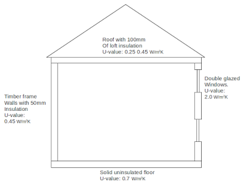
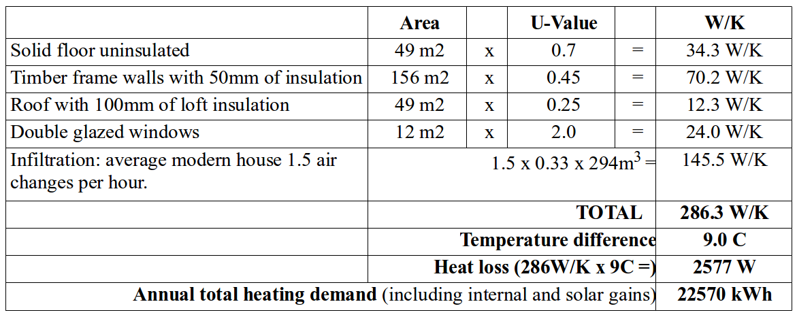

## Building Energy Modelling: A simple javascript model

Putting what we covered in the last two posts together we can create a basic building energy model that covers building fabric heat loss and infiltration heat loss.

To start with the model extends the very basic example given in the first blog of the cube house by allowing for different building elements with different U-values: Walls, Roof, Floor, Windows. This is implemented in the same way as can be found in the full SAP model.

When calculating the heat loss from a building with multiple elements its useful to break the equation for building fabric element heat loss (Building fabric element heat loss = Area x U-Value x temperature difference)  down into three parts.

1. Calculate the Area x U-Value for each element giving the heat loss in Watts per Kelvin (W/K) for that building element.
2. Calculate the sum of the heat loss in W/K for all elements.
3. Calculate the the total heat loss in Watts for a given temperature difference.

Here's an example house with a fairly simple range of elements, also added is an average infiltration rate for a modern house as covered in the last blog post.

**Note:** We still need to take into account: solar and internal gains and seasonal temperature variation as a minimum before we get the actual demand on the heating system.

So that's all quite straightforward, the open source SAP implementation is written primarily in javascript with all the calculations happening on the 'client' (in the internet browser). The model combined with an interface updated in real-time makes for a dynamic experience with everything being calculated and visualised on the fly.

Here's a javascript implementation of the above with just a simple console output for now:

Javascript code example

    var elements = [ 
      {itemname: "Floor", grossarea: 49.0, openings: 0, uvalue: 0.7}, 
      {itemname: "Walls", grossarea: 168.0, openings: 12.0, uvalue: 0.45}, 
      {itemname: "Loft", grossarea: 49.0, openings: 0, uvalue: 0.25}, 
      {itemname: "Windows", grossarea: 12.0, openings: 0, uvalue: 2.0} 
    ]; 

    var  fabric_heat_loss_WK = 0; 

    for (z in elements) { 
      elements[z].netarea = elements[z].grossarea - elements[z].openings; 
      elements[z].axu = elements[z].netarea * elements[z].uvalue; 
      fabric_heat_loss_WK += elements[z].axu; 
    } 

    var volume = 294;
    var infiltration = 1.5; // Air change per hour
    var infiltration_WK = 0.33 * infiltration * volume;

    var internal_temperature = 21; 
    var external_temperature = 12; 

    var total_heat_loss_WK = fabric_heat_loss_WK + infiltration_WK;

    var  heatloss =  total_heat_loss_WK * ( internal_temperature -  external_temperature );

    console.log("Total heating requirement: "+heatloss.toFixed(0)+" W"); 
    console.log("Annual heating demand: "+(heatloss*0.024*365).toFixed(0)+" kWh"); 

You can run this code directly on your computer via linux terminal without using an internet browser using nodejs http://nodejs.org/. To install nodejs on Ubuntu type:

    sudo apt-get install nodejs

create a file called bem01.js and copy the javascript above into it and save.
Locate the file with terminal and then run using:

    nodejs bem01.js

it should output:

    Total heating requirement: 2577 W 
    Annual heating demand: 22570 kWh

**Seasonal temperature variation**
So far to keep things simple we have assumed constant external temperature and internal temperature. There are different ways to take into account temperature variation, one common method is degree days http://www.degreedays.net/introduction.

The SAP model uses average indoor temperature minus average external temperature on a monthly basis to calculate total heat demand and then it has a factor that reduces the % of a month the heating is on for if gains from solar and internal sources are significant.

**Different sources of heat gain**
What we have covered so far covers the heat loss side of the equation but the heating energy requirement is not yet what our heating system needs to provide instead it is the total heat energy going into the system that is our house including heat from other sources in addition to the main heating system, the other heat gains typically taken into account are: Solar gains and Internal Gains which usually consist of Cooking, Lighting  Appliances and metabolic gains (These are the sources covered in the SAP model)

The full energy balance equation for a steady state building energy model looks like this:

    solar_gains + cooking + lighting + hotwater + appliances + metabolic + heating_system =
( fabric_heat_loss_WK + infiltration_WK) x (internal_temperature – external_temperature)

This is really the fundamental equation that describes a simple steady state building energy model, a large part of the SAP model is concerned with calculating estimates for all the variables that go into this equation.

**Integrating Monitoring into a building energy model.**
The above equation shows several variables that could be provided or inferred to some degree by monitoring.

Internal temperature could be provided by an array of temperature sensors throughout a building. External temperature could be provided by an external temperature sensor or pulled in from a local weather station.

Depending on energy source: cooking, lighting, hot water, appliances and heating system input could be provided from either electricity monitoring or electric and gas, the degree of utilisation would need to be taken into account.

Solar gains could be calculated from a irradiance sensor or how about normalised solar PV data?
