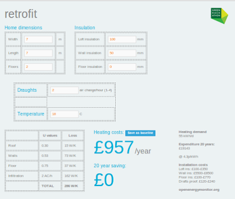
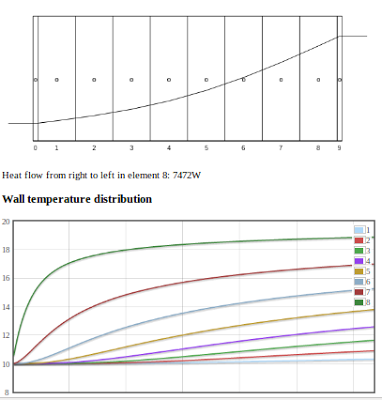
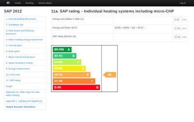

# Development history

A summary of building energy modelling development within the OpenEnergyMonitor project.

## Late 2011: Reading The Whole House Book

In the blog post [what kind of information can we extract from power measurements](http://openenergymonitor.blogspot.com/2013/06/what-kind-of-information-can-we-extract.html) I concluded that I needed a simple model of my electricity use in addition to the monitored data in order to ultimately get to a list of actions that I need to do to optimise my electricity use.

The other conclusion was that to significantly reduce electricity consumption further I would need to change the heating system and to take a whole house view: improve the building fabric performance by increasing insulation levels, reducing draughts and improving solar gain in order to reduce heating demand in the first place.

In the [energy study of local households that we did in 2011-2012](http://openenergymonitor.blogspot.co.uk/2012/01/community-energy-plan-maker.html) heating energy came out as the largest energy user, we recorded details about house construction, levels of insulation, perceived comfort, temperature, draught levels, amount of glazing etc but didn't have the tools or knowledge to be able to give any sort of tailored advice, relate general statements that we're all familiar with like insulation can reduce energy demand by x% to a particular households situation, it wasn't in the remit of the project but we could see that that was what was needed next.

At home it was also clear that heating was the largest user of energy and the area with the most potential to achieve significant energy savings and carbon reduction especially as electricity use is already optimised as far as possible.

At this point I started to read up on low energy building design to get a better understanding of the subject. I had one of those learning aha moments when I read chapter 7 of [The Whole House Book by Pat Borer & Cindy Harris](http://www.amazon.co.uk/The-Whole-House-Book-Ecological/dp/1902175220) which outlines a really simple building energy model:

The model starts by calculating how many Watts are lost through the building fabric per degree Kelvin temperature difference between the inside and outside temperature. This is calculated by multiplying the area of the various building elements such as walls, windows, roof and floor by their U-values. The model also takes into account the amount of heat lost via draughts (infiltration). The model then uses the concept of degree-days to calculate the annual heating demand.

Before reading this I had thought that to get any sort of useful estimated output on effect of adding insulation to a building a full dynamic simulation would be needed. But this simple model showed that you can get some surprisingly informative estimates from some quite straightforward calculations.

For the rest of the book Pat Borer & Cindy Harris use a more detailed calculation that also takes into account solar gains, internal (casual) gains and water heating requirements. If your looking for a good book on low energy building design, self-build and energy calculations Id really recommend this book.

## Early 2012: First attempts and research

It was not long after reading the Whole House Book that Glyn and I went to a green hackathon in London (January 2012) and I spent my time creating a small web app that implemented a really basic model that produced estimates of 20 year savings of implementing various building fabric improvement measures.

Source code: [https://github.com/openenergymonitor/retrofit.git](https://github.com/openenergymonitor/retrofit.git)

I had not quite realised the importance of solar and internal gains at that point or indeed utilisation factors and heating patterns so the green hackathon retrofit calculator will only be remotely close to actual heating demand in very leaky buildings, with few windows and consistently heated to an even set temperature all year. Paul Tanner pointed out the heating pattern flaw at the time in a tweet but it wasnt until more recently that I got how significant the difference can be.

After the green hackathon retrofit calculator I tried to develop the idea of a calculator that would output a list of proposed measures, their energy savings and financial payback but had low confidence in the accuracy of its output so decided to shelve it for a while.

At around the same time I did a little work on dynamic simulation of heat conduction through a wall but was also unsure of its accuracy.

I had by now read through the [SAP worksheet](http://www.bre.co.uk/sap2012/page.jsp?id=2759) (The UK's standard assessment procedure for assessing the energy performance of domestic buildings) many times but thought it a little too long to embark on implementing it, although basing an energy model on a standard approach supported widely seemed like the best approach.

Searching for open source SAP implementations I found a useful open source version of the 2009 SAP worksheet implemented as a open office spreadsheet by Wookey here: [http://wookware.org/files/SAPWorksheet9.80.ods](http://wookware.org/files/SAPWorksheet9.80.ods) which if you prefer spreadsheets to code is certainly worth looking at. There was also a thread on the greenbuildingforums calling for good open source building energy modelling software with a lively debate: [http://www.greenbuildingforum.co.uk/newforum/comments.php?DiscussionID=6574&page=1#Item_0](http://www.greenbuildingforum.co.uk/newforum/comments.php?DiscussionID=6574&page=1#Item_0)

In my research I also came across a fully dynamic open source building energy model called esp-r developed by the University of Strathclyde [http://www.esru.strath.ac.uk/Programs/ESP-r.htm](http://www.esru.strath.ac.uk/Programs/ESP-r.htm) and created a page on how to install it on ubuntu on the openenergymonitor site here: [http://openenergymonitor.org/emon/node/1715](http://openenergymonitor.org/emon/node/1715)

I'm also more recently aware that there is another open source dynamic building energy modelling project called OpenStudio which looks like it has a nice front end, OpenStudio is a National Renewable Energy Laboratories project [https://openstudio.nrel.gov](https://openstudio.nrel.gov/) and has sketchup integrations, looks nice!

## Late 2012: Carbon Coop and Open Source SAP 2012

Towards the end of 2012 I met Matt Fawcett of Carbon Coop and heard at length about all the exciting work they are doing around retrofit, see the blog here: [http://openenergymonitor.blogspot.co.uk/2013/05/carbon-coop.html](http://openenergymonitor.blogspot.co.uk/2013/05/carbon-coop.html)

As I mentioned in the post Carbon coop and their technical partners URBED have put a lot of work into an assessment method for assessing a households suitability for retrofit work, working out a list of measures including full details and costings, how a household can achieve 60-80% carbon reduction. 

Their assessment method is based on SAP 2012 and was implemented by architect [Charlie Baker](http://www.urbed.coop/team/charlie-baker) of URBED in an extensive Mac Numbers spreadsheet. Its worth watching Charlie's talk at the radical emissions reduction conference for context on the work carbon coop are doing [here](http://vimeo.com/album/2648454/video/81956917)

[http://carbon.coop/assessments/CC_EXAMPLE_ASSESSMENT2.pdf](http://carbon.coop/assessments/CC_EXAMPLE_ASSESSMENT2.pdf)

Matt explained that to take things further they wanted to integrate the monitoring with the assessments in order to be able to reduce assumptions used and that they thought that longer term an open source online version of the retrofit assessment method would be key to make retrofit more accessible and open for a greater number of people.

At home I also wanted to move forward with this idea of being able to use monitoring combined with a building energy model to understand the current building fabric performance at home and the lab and get a better understanding of what the effect would be of adding insulation and draught proofing.

### December 2012 (v1)

Matt and I started the process of converting the SAP 2012 pdf worksheet specification into a open source javascript web application with the first draft being released in late december 2012 and worked on intermittently after that. This first version is now archived here: [https://github.com/emoncms/archive/tree/master/sap](https://github.com/emoncms/archive/tree/master/sap)

### September 2013 (v2.a)

It soon became clear that it was possible to refactor the application to be much more modular and that this would make further development easier, make the code easier to read and so on.
A much simplified version of the building energy model that started to include these ideas for modularisation was [realeased in September 2013](https://github.com/emoncms/openbem/commit/66c2705a6628c4cee83d05c5250f639ff5ba3e03).

### January 2014 (v2.b)

This was extended to cover the majority of the SAP model in [January-February 2014](https://github.com/emoncms/openbem/commit/95e5a0f756e36e1ab3943355a269ae2e0005c085) which was by now a complete rewrite of the first version.

### July 2014 (v3)

A third refactor was carried out in July 2014, simplifying the way the calculations where organised over v2 and providing clearer seperation between the data model, model calculation and UI (views).
[https://github.com/emoncms/openbem/commits/v3](https://github.com/emoncms/openbem/commits/v3)

## Exploration and development of dynamic models, September 2013

**Blog post:** [Measuring building thermal performance - coheating tests](http://openenergymonitor.blogspot.co.uk/2013/09/measuring-building-thermal-performance.html) 

