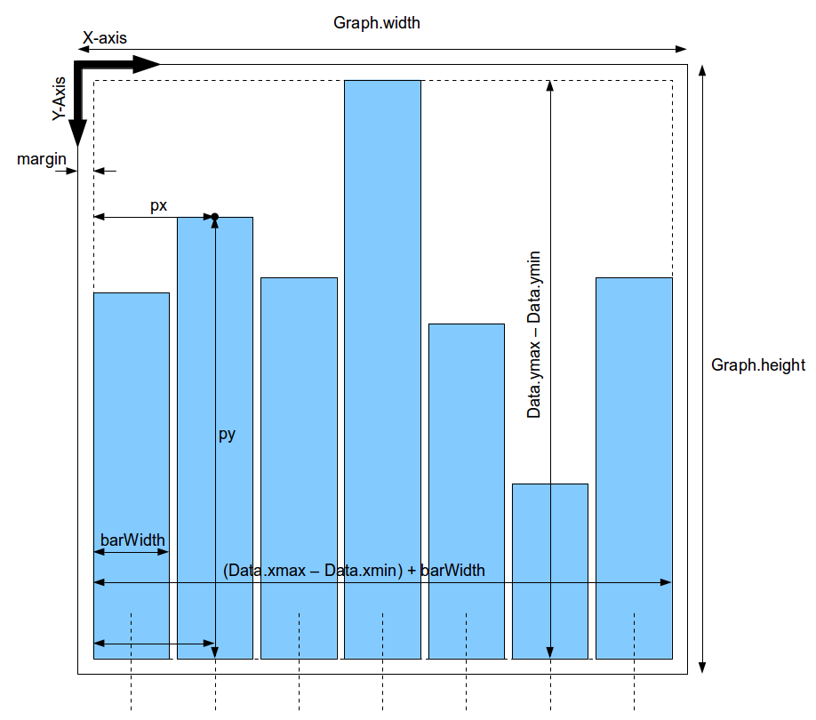
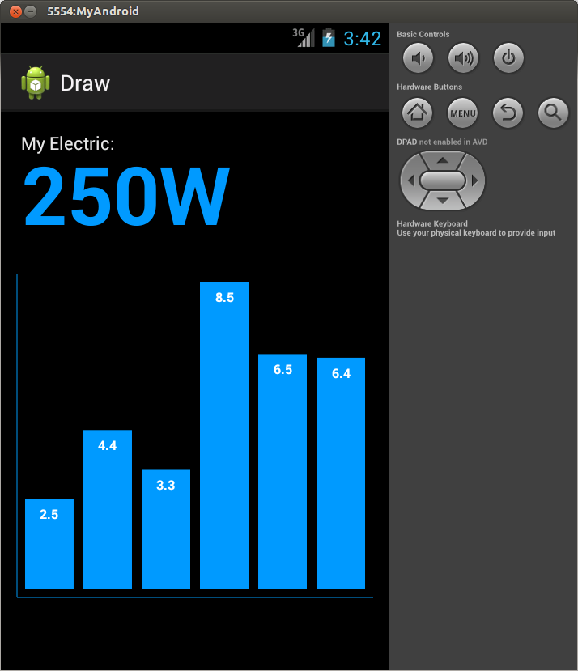

## Drawing a myelectric style bar chart

Both the myelectric emoncms module and the soon to be myelectric android app have a bar chart that is written using the javascript 2d graphics canvas on emoncms and the java 2d graphics canvas on the android app.

This short guide details how the bar chart is built. Writting your own graphs is really not that complicated and once you have a grasp of 2d graphics canvas sometimes its easier to write your own graph to get the style that you want. The myelectric graph was written from scratch in order to achieve a precice look: simple color scheme, bar height values overlayed on the bar, kWh label in the top-left corner.

The essential part of creating a graph is mapping the data time:value coordinates on to the 2d graphics canvas x:y pixel coordinates. 

Lets start by taking an example dataset for 7 days of electricity consumption in kWh/d:

    time, kWh
    1401235200, 4.8
    1401321600, 5.8
    1401408000, 5.0
    1401494400, 7.6
    1401580800, 4.4
    1401667200, 2.3
    1401753600, 5.0
    
Lets give our graph a width of 400px (pixels) and height of 400px and a margin of 10px.

### 1) Mapping kWh value to the canvas y-axis

In the diagram above our graph has a margin between the outer box and the internal dotted line box. The largest bar that we have should span the whole height of the internal box.

The largest bar is 7.6 kWh, defining 7.6 as out maximum (Data.ymax) and 0 kWh as our minimum (Data.ymin) the height of the 7.6kWh bar should be the height of the internal space = 400px - 2x 10px = 380px. The height of a 0 kWh bar should be 0px and so any bar inbetween can be calculated as:

    barheightpx = (kwhvalue / 7.6) x 380px
    
or in a more generic form:

    py = ((kwhvalue - ymin) / (ymax - ymin)) x innerheightpx;
    
where:

    ymin = 0
    ymax = 7.6
    innerheightpx = graphheightpx - 2 x margin
    

### 2) Mapping time on to the canvas x-axis

Mapping the x-axis is very similar:

    px = ((time - xmin) / (xmax - xmin)) x innerwidthpx;
    
But in order that the bar's which are centered at their x positions dont overlap the left and right edge of the graph the xmin and xmax property need to be extended slightly:

    xmin = dataxmin - barwidth / 2
    xmax = dataxmax + barwidth / 2
    
Where barwidth is also defined in time i.e: the bar width could be set to span 20 hours.    

### 3) Putting it all together

Generic example code:

    data = [
        [1401235200, 4.8],
        [1401321600, 5.8],
        [1401408000, 5.0],
        [1401494400, 7.6],
        [1401580800, 4.4],
        [1401667200, 2.3],
        [1401753600, 5.0]
    ]
    
    graphWidth = 400
    graphHeight = 400
    margin = 10
    
    innerWidth = graphWidth - 2*margin
    innerHidth = graphHidth - 2*margin
    
    xmin = 1401235200
    xmax = 1401753600
    ymin = 0
    ymax = 7.6
    
    barWidth = 20 * 3600
    
    xmin -= barWidth / 2
    xmax += barWidth / 2
    
    barWidthpx = (barWidth / (xmax - xmin)) * innerWidth
    
    for (z in data)
    {
        time = data[z][0]
        value = data[z][1]
        
        px = ((time - xmin) / (xmax - xmin)) * innerWidth
        py = ((value - ymin) / (ymax - ymin)) * innerHeight
            
        barLeft = margin + px - barWidthpx / 2
        barBottom = margin + innerHeight
            
        barTop = barBottom - py
        barRight = barLeft + barWidthpx
        
        drawRect(barLeft,barTop,barRight,barBottom)
    }
    
    
**Note:** the y axis goes down from the top of the screen rather than up from the bottom, hence: barTop = barBottom **- py**

### Android java canvas

A full example app of drawing the graph plus a few extras:

Copy and paste into a new android application project to run:

    package com.example.draw;

    import java.util.Iterator;
    import java.util.LinkedHashMap;

    import android.os.Bundle;
    import android.app.Activity;
    import android.content.Context;
    import android.graphics.Canvas;
    import android.graphics.Color;
    import android.graphics.Paint;
    import android.graphics.Paint.Align;
    import android.graphics.Typeface;
    import android.view.View;

    public class MainActivity extends Activity {

	    @Override
	    protected void onCreate(Bundle savedInstanceState) {
		    super.onCreate(savedInstanceState);
		
		    DrawView drawView = new DrawView(this);
            drawView.setBackgroundColor(Color.BLACK);
            setContentView(drawView);
	    }
    }

    class DrawView extends View {
	    Paint paint = new Paint(Paint.ANTI_ALIAS_FLAG);
	
        public DrawView(Context context) {
            super(context);
        }
        
        @Override
        public void onDraw(Canvas canvas) {
        	
        	paint.setColor(Color.BLACK);
            canvas.drawRect(0, 0, getWidth(), getHeight(), paint);
            
            // My Electric text
            paint.setColor(Color.rgb(230, 230, 230));
            paint.setTextSize(22);
            canvas.drawText("My Electric:", 25, 47, paint);
            
            // Power value text
            float power = 250;
            paint.setColor(Color.rgb(6,153,250));
            paint.setTextSize(100);        
            Typeface tf = Typeface.create("Roboto Bold",Typeface.BOLD);
            paint.setTypeface(tf);
            canvas.drawText(String.format("%.0f", power)+"W", 25, 140, paint);
            
            // Draw graph
            drawGraph(canvas);
        }
        
        public void drawGraph(Canvas canvas)
        {
            // Example data
            LinkedHashMap data = new LinkedHashMap<Integer, Float>();
            data.put(1401321600, 2.5f);
            data.put(1401408000, 4.4f);
            data.put(1401494400, 3.3f);
            data.put(1401580800, 8.5f);
            data.put(1401667200, 6.5f);
            data.put(1401753600, 6.4f);

            int left = 20;
            int top = 200;

            int graphWidth = getWidth()-40;
            int graphHeight = 400;
            int margin = 10;

            int innerWidth = graphWidth - 2*margin;
            int innerHeight = graphHeight - 2*margin;

            // Draw Axes
            paint.setColor(Color.rgb(6,153,250));
            canvas.drawLine(left, top, left, top+graphHeight, paint);
            canvas.drawLine(left, top+graphHeight, left+graphWidth, top+graphHeight, paint);

            // Auto detect xmin, xmax, ymin, ymax
            float xmin = 0;
            float xmax = 0;
            float ymin = 0;
            float ymax = 0;
            boolean s = false;

            Iterator<Integer> keySetIterator = data.keySet().iterator();
            while(keySetIterator.hasNext()){
                Integer time = keySetIterator.next();
                float value = (Float) data.get(time);

                if (!s) {
                    xmin = time;
                    xmax = time;
                    ymin = value;
                    ymax = value;
                    s = true;
                }

                if (value>ymax) ymax = value;
                if (value<ymin) ymin = value;
                if (time>xmax) xmax = time;
                if (time<xmin) xmin = time;               
            }

            // Fixed min y
            ymin = 0;

            float barWidth = 3600*20;
            xmin -= barWidth /2;
            xmax += barWidth /2;

            float barWidthpx = (barWidth / (xmax - xmin)) * innerWidth;

            // kWh labels on each bar
            paint.setTextAlign(Align.CENTER);
            paint.setTextSize(16);

            keySetIterator = data.keySet().iterator();

            while(keySetIterator.hasNext()){

                Integer time = keySetIterator.next();
                float value = (Float) data.get(time);

                float px = ((time - xmin) / (xmax - xmin)) * innerWidth;
                float py = ((value - ymin) / (ymax - ymin)) * innerHeight;

                float barLeft = left + margin + px - barWidthpx/2;
                float barBottom = top + margin + innerHeight;

                float barTop = barBottom - py;
                float barRight = barLeft + barWidthpx;

                paint.setColor(Color.rgb(6,153,250));
                canvas.drawRect(barLeft,barTop,barRight,barBottom,paint);

                // Draw kwh label text
                if (py>25) {
                  paint.setColor(Color.rgb(255,255,255));
                  canvas.drawText(String.format("%.1f", value), left+margin+px, barTop + 25, paint);
                }
            }
        }
    }
