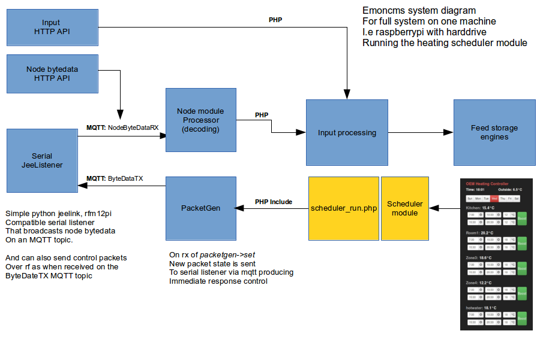
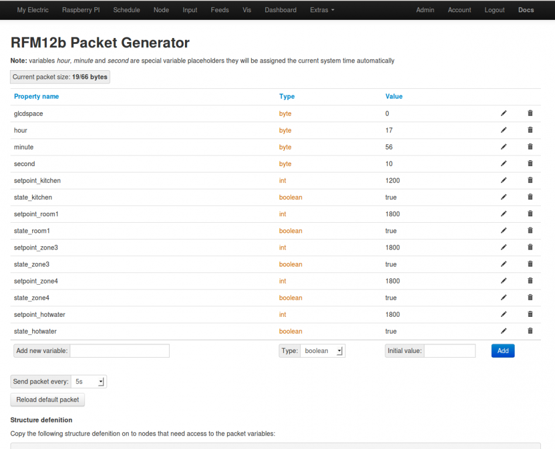

## How to setup a full stack emoncms raspberry PI + HDD basestation + scheduler

This guide details how to install emoncms and the heating scheduler module on a rfm12pi + raspberrypi + HDD hardware setup.

The heating scheduler module makes it possible to control heating schedules in several zones in a building, its a module that is in the early stages of development.

The following diagram gives an overview of the main software components involved in the application:

Start by downloading the official raspberrpi raspbian image

    [http://www.raspberrypi.org/downloads](http://www.raspberrypi.org/downloads)
    
Upload the image to both the harddrive and the SD Card. On Linux dd can be used for this but care needs to be taken to ensure you select the correct target device so as not to loose data

To check the mount location of the SD card or harddrive use:

    df -h
    
Unmount any mounted SD card partitions
    
    umount /dev/sdb1
    umount /dev/sdb2
    
Write the raspbian image to the SD card (Make sure of=/dev/sdb is the correct location)
    
    sudo dd bs=4M if=2014-01-07-wheezy-raspbian.img of=/dev/sdb
    
## Running from the harddrive:
 
### Change /boot/cmdline.txt on the SD card

Mount the SD Card on your computer and open the boot partition. Open to edit the file:

    /boot/cmdline.txt
    
**Tip** a useful tool for opening a terminal window in a particular linux folder is nautilus-open-terminal

    sudo apt-get install nautilus-open-terminal
    
You will need to logout and log back in to your computer and then right click in the folder and click on open in terminal.
    
You may need to use sudo to open the file.

Over write with:

    dwc_otg.lpm_enable=0 console=tty1 root=/dev/sda2 rootfstype=ext4 elevator=deadline rootwait

This both tells the PI that the root filesystem is on /dev/sda2 and to not use the serial port for raspberrypi debug purposes as we need it for emoncms.

### Change /etc/fstab on HDD

Mount the Harddrive on your computer and open the main partition. Open to edit the file:

    /etc/fstab

Change the root device from: /dev/mmcblk0p2 / to be /dev/sda2

That's all that is needed to get your raspberrypi running of a harddrive rather than the SD card. You can now insert the SD card in the raspberrypi and connect up the harddrive, power up and use the raspberrypi in the same way as you would use the pi if it was running off an SD card.

## Installing the software needed

Find the IP address of your raspberrypi on your network then connect and login to your pi with SSH, for windows users there's a nice tool called [putty](http://www.putty.org/) which you can use to do this. To connect via ssh on linux, type the following in terminal:

    ssh pi@YOUR_PI_IP_ADDRESS

It will then prompt you for a username and password which are: **username:**pi, **password:**raspberry.

### Install dependencies

Update the rasbian repositories with:

    sudo apt-get update

Install all dependencies:

    sudo apt-get install apache2 mysql-server mysql-client php5 libapache2-mod-php5 php5-mysql php5-curl php-pear php5-dev php5-mcrypt git-core redis-server build-essential ufw ntp python-serial python-configobj mosquitto mosquitto-clients python-pip python-dev

Install python pip dependencies

    sudo pip install tendo
    sudo pip install mosquitto

Install pecl dependencies (redis and swift mailer)

    sudo pear channel-discover pear.swiftmailer.org
    sudo pecl install redis swift/swift
    pecl install -B SAM
    
Add pecl modules to php5 config

    sudo sh -c 'echo "extension=redis.so" > /etc/php5/apache2/conf.d/20-redis.ini'
    sudo sh -c 'echo "extension=redis.so" > /etc/php5/cli/conf.d/20-redis.ini'

Emoncms uses a front controller to route requests, modrewrite needs to be configured:

    $ sudo a2enmod rewrite
    $ sudo nano /etc/apache2/sites-enabled/000-default

Change (line 7 and line 11), "AllowOverride None" to "AllowOverride All".
That is the sections <Directory /> and <Directory /var/www/>.
[Ctrl + X ] then [Y] then [Enter] to Save and exit.

Restart the lamp server:

    $ sudo /etc/init.d/apache2 restart
    
Edit the _inittab_ file to allow the python serial listener to use the serial port, type:

    sudo nano /etc/inittab

At the bottom of the file comment out the line, by adding a ‘#’ at beginning:

    # T0:23:respawn:/sbin/getty -L ttyAMA0 115200 vt100
    
Install Logger

    sudo pear channel-discover pear.apache.org/log4php
    sudo pear install log4php/Apache_log4php

ensure that log file has write permissions for www-data, pi and root.

    cd
    > emoncms.log
    sudo chmod 660 /home/pi/emoncms.log 

### Security

[http://blog.al4.co.nz/2011/05/setting-up-a-secure-ubuntu-lamp-server/](http://blog.al4.co.nz/2011/05/setting-up-a-secure-ubuntu-lamp-server/)

#### Install ufw

ufw: uncomplicated firewall, is a great little firewall program that you can use to control your server access rules. The default set below are fairly standard for a web server but are quite permissive. You may want to only allow connection on a certain ip if you will always be accessing your pi from a fixed ip.

UFW Documentation
[https://help.ubuntu.com/community/UFW](https://help.ubuntu.com/community/UFW)

    apt-get install ufw
    ufw allow 80/tcp
    ufw allow 443/tcp
    ufw allow 22/tcp
    ufw enable

#### Change root password

Set root password

    passwd root

The default root password used in the ready to go image is **{@.o7SNf~Qg3-0}#SRCM**. 
Change this to a hard to guess password to make your root account secure.

#### Secure MySQL

Run mysql_secure_installation see [mysql docs](http://dev.mysql.com/doc/refman/5.0/en/mysql-secure-installation.html)

    mysql_secure_installation

#### Secure SSH

Disable root login:

    sudo nano /etc/ssh/sshd_config

Set **PermitRootLogin** to **no**
    
### Redis save's

Redis by default will save its in-memory database to the harddisk every x number of changed keys. As emoncms is write intensive we probably dont need it to update as often as the default setting. By changing it to the save every 900 key changes it will probably save around once every 10 mins or so depending on your post rate:

Redis settings: change save to: save 900 1 only

    sudo nano /etc/redis/redis.conf

### Apache access logs

Comment the access log to other-vhosts (add #)

    sudo nano /etc/apache2/conf.d/other-vhosts-access-log
    
### Reboot the pi

    sudo reboot

### Install the emoncms application via git

Git is a source code management and revision control system but at this stage we use it to just download and update the emoncms application.

First cd into the var directory:

    $ cd /var/

Set the permissions of the www directory to be owned by your username:

    $ sudo chown $USER www

Cd into www directory

    $ cd www

Download emoncms using git:

    $ git clone -b mqtt https://github.com/emoncms/emoncms.git
    
Once installed you can pull in updates with:

    git pull
    
### Create a MYSQL database

    $ mysql -u root -p

Enter the mysql password that you set above.
Then enter the sql to create a database:

    mysql> CREATE DATABASE emoncms;

Exit mysql by:

    mysql> exit
    
### Create data repositories for emoncms feed engine's

You can copy and paste all of these in one go (press enter at the end)

    sudo mkdir /var/lib/phpfiwa
    sudo mkdir /var/lib/phpfina
    sudo mkdir /var/lib/phptimeseries

    sudo chown www-data:root /var/lib/phpfiwa
    sudo chown www-data:root /var/lib/phpfina
    sudo chown www-data:root /var/lib/phptimeseries

### Set emoncms database settings.

cd into the emoncms directory where the settings file is located

    $ cd /var/www/emoncms/

Make a copy of default.settings.php and call it settings.php

    $ cp default.settings.php settings.php

Open settings.php in an editor:

    $ nano settings.php

Enter in your database settings.

    $username = "USERNAME";
    $password = "PASSWORD";
    $server   = "localhost";
    $database = "emoncms";

Save (Ctrl-X), type Y and exit

### Install packetgen and scheduler

    cd /var/www/emoncms/Modules
    git clone -b mqtt https://github.com/emoncms/packetgen.git
    
    git clone https://github.com/emoncms/scheduler.git

### Create an account in emoncms and login
This will automatically create the database

### Setup the scheduler

**1) The first thing to do is set up the zones:**

a) Open the scheduler interface file /var/www/emoncms/Modules/scheduler/scheduler_view.php.

b) Navigate to line 164:

    var zones = ['Kitchen','Room1','Zone3','Zone4','hotwater'];

These are the names of the example zones, change these to the zone names you wish to have.

If your temperature feeds have the same names as the zone names, the scheduler interface will automatically pick up the temperature value and display it next to the zone name in the scheduler interface.

If there is a feed called outside, its value will also be picked up and displayed. The name of the outside feed to pick up can be set with: var outsidetempname = 'outside';

If your zone name's dont change you will need to force the interface to rewrite the configuration by setting: (line 160)

    var overwritedb = false;

to

    var overwritedb = true;
    
**Note: scheduler_run.php start position**
Its possible to set the position in the packet gen packet that the schedule variables get written too. The default position is to start at the 4th variable, to change it open scheduler_run.php and change the $start_variable = 4; at the top of the script

### Test run

Login to your pi three times to create three terminal windows.

Locate the emoncms run folder:

    cd /var/www/emoncms/run

Configure your radio settings and target user in jeelistener.conf
The target user will probably be 1 if its the first account you created in emoncms.
To get the emoncms user id type http://localhost/emoncms/user/get.json
    
In the first terminal window run jeelistener.py

    python jeelistener.py
    
In the second terminal window run nodeprocessor.php

    sudo php nodeprocessor.php
    
And in the third terminal window run scheduler_run.php

    sudo php /var/www/emoncms/Modules/scheduler/scheduler_run.php

With these three scripts running data should now start to appear in the emoncms node interface.

Navigate to the PacketGen module in emoncms: Extras > RFM12b Packet Generator

You should now see the zone set points and zone states in the packetgen interface, the temperatures are multiplied by 100 so that they can be sent as 2 byte integers.

### Permanent run

**1) Running with cron**

Running the scripts via cron in this way will guarantee that the script restarts if it for any reason crashes and exits. Cron will try to run the script once every minute but the script has an inbuilt check to ensure that only one instance of the script runs at any given time.

    sudo crontab -e

add the following lines:

    * * * * * python /var/www/emoncms/run/jeelistener.py 2>&1
    * * * * * php /var/www/emoncms/run/nodeprocessor.php 2>&1
    * * * * * php /var/www/emoncms/Modules/scheduler/scheduler_run.php 2>&1
    
To stop these scripts, remove the entries from cron and kill the processes manually.

To find the process id of the python script run: 

    ps aux | grep python 
    
and php:

    ps aux | grep php
    
kill the scripts:
    
    kill _processid_
    
As this develops its likely that these will be ran from a debian service script.

